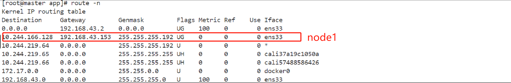
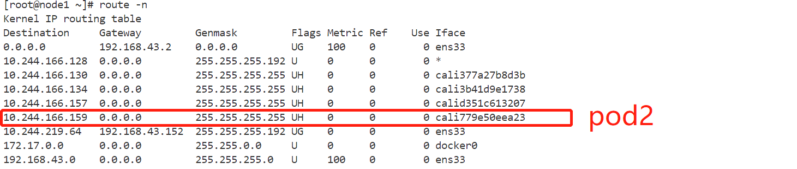
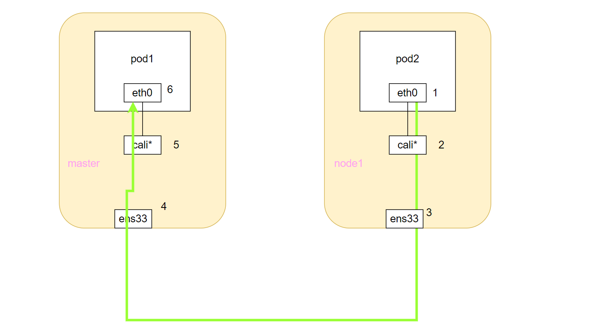
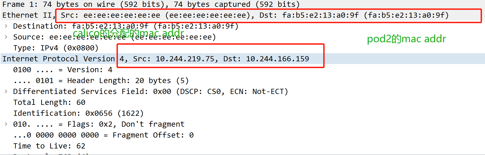
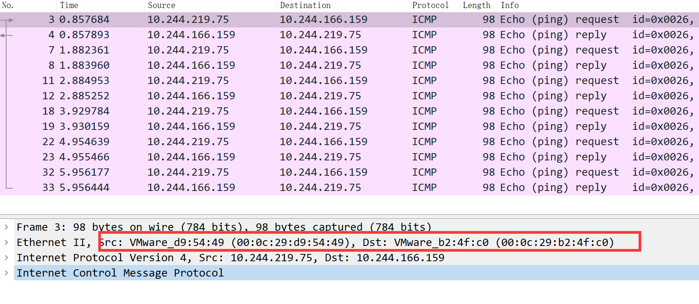
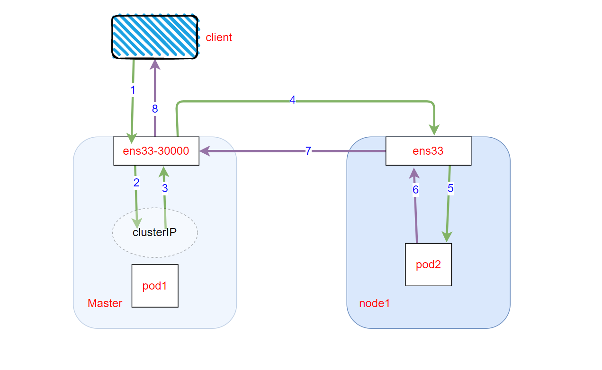
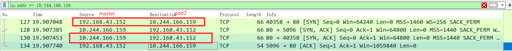
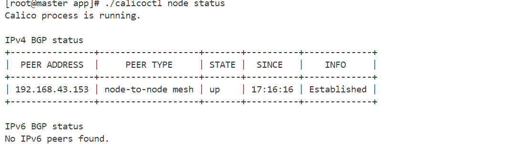
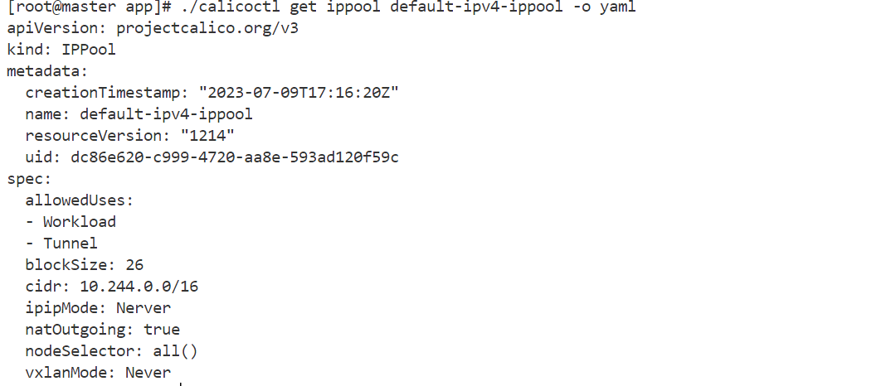

## calico 数据面转发原理分析 native route mode

calico version : v3.22

master ip: 192.168.43.152

node1 ip : 192.168.43.153

pod1 ip : 10.244.219.75

pod2 ip : 10.244.166.159

pod2 serviceIP ： 10.1.118.185

pod命名空间为 test

工具 : tcpdump wireshark

镜像 ： praqma/network-multitool:latest

### 一、pod1 to remote pod2

#### 发包

pod1 访问 pod2时，先根据pod1内的路由信息，选择下一跳地址和mac地址，如下图，这里使用了linux的proxy_arp功能，不像flannel的host-gw 模式， 二层通信时通过bridge就可以返回mac地址给arp请求，这里 caclio cni 就是对每个创建的veth对，对主机端的veth写入配置 `echo 1 > /proc/sys/net/ipv4/conf/cali17fddc925b9/proxy_arp`   

[proxy_arp理解](https://www.sobyte.net/post/2022-06/proxy-arp-calico/) ,  

 [所有cali*接口mac地址都是ee:ee:ee:ee:ee:ee FAQ](https://docs.tigera.io/calico/latest/reference/faq#why-do-all-cali-interfaces-have-the-mac-address-eeeeeeeeeeee)

当对169.254.1.1 发起arp请求时，主机端 cali* 接口会返回一个固定mac地址给pod1，执行`k exec -it pod1 -n test -- sh` 查看pod namespace下的路由和arp信息

```
/ # route -n
Kernel IP routing table
Destination     Gateway         Genmask         Flags Metric Ref    Use Iface
0.0.0.0         169.254.1.1     0.0.0.0         UG    0      0        0 eth0
169.254.1.1     0.0.0.0         255.255.255.255 UH    0      0        0 eth0
```

pod 内arp信息 ， 

```
/ # arp -n
Address                  HWtype  HWaddress           Flags Mask            Iface
169.254.1.1              ether   ee:ee:ee:ee:ee:ee   C                     eth0
192.168.43.152           ether   ee:ee:ee:ee:ee:ee   C                     eth0
```

出了pod网络空间后，走宿主机内核的路由表进行转发，如下图：命中node1这条路由，下一跳是node1

到达node1后，查找node1内核路由表，根据ip得到转发接口是cali779e50eea23，将数据包送往pod2内部



#### 收包



和发包路径类似

1. pod2 响应时更换源ip地址和目的地址，在pod2 中的eth0 接口依赖proxy_arp进行二层封包，到达主机端cali接口
2. 主机端cali接口进行二层解包，进入三层根据路由表进行路由
3. 命中路由表项到达node1的ens33 接口，在二层根据下一跳地址查找mac地址，进行二层封装，转发回到master节点，
4. 到达master节点后进行二层解包，
5. ip包根据主机路由表项到达cali接口，
6. cali接口进行二层封包，转发回到pod1中。

#### tcpdump结果

pod2 内执行 `tcpdump -i eth0 -w pod1-pod2.pcap`



node1 ens33 `tcpdump -i ens33 -w pod1-pod2.pcap`



### 二、pod1 通过访问 test/pod2-service 到达pod2时

在基于iptables的kube-proxy中，针对每个service每个节点都会存在以下na表t的chain，

1. 进入Chain PREROUTIN
2. Chain KUBE-SERVICES
3. Chain KUBE-SVC-OCJIUORDHIMMVHOI
4. Chain KUBE-SEP-X4R67US2PCZJVEDY
4. KUBE-MARK-MASQ 不匹配下面的规则跳过该chain
5. DNAT将目的ip修改为pod2的ip
5. Chain POSTROUTING (policy ACCEPT)
5. Chain KUBE-POSTROUTING

接下来数据转发过程和情况一类似。

查看iptables中nat表下的所有的chain命令 ： ` iptables -t nat -L -n`  

查看某个chain下的所有的规则 ： `iptables -t nat -S KUBE-POSTROUTING`

```shell
Chain PREROUTING (policy ACCEPT)
target     prot opt source               destination         
KUBE-SERVICES  all  --  0.0.0.0/0            0.0.0.0/0            /* kubernetes service portals */

Chain KUBE-SERVICES (2 references)
target     prot opt source               destination 
KUBE-SVC-OCJIUORDHIMMVHOI  tcp  --  0.0.0.0/0            10.1.118.185         /* test/pod2-service cluster IP */ tcp dpt:80

Chain KUBE-SVC-OCJIUORDHIMMVHOI (1 references)
target     prot opt source               destination         
KUBE-SEP-X4R67US2PCZJVEDY  all  --  0.0.0.0/0            0.0.0.0/0            /* test/pod2-service */

Chain KUBE-SEP-X4R67US2PCZJVEDY (1 references)
target     prot opt source               destination         
KUBE-MARK-MASQ  all  --  10.244.166.159       0.0.0.0/0            /* test/pod2-service */
DNAT       tcp  --  0.0.0.0/0            0.0.0.0/0            /* test/pod2-service */ tcp to:10.244.166.159:80

Chain KUBE-MARK-MASQ (14 references)
target     prot opt source               destination         
MARK       all  --  anywhere             anywhere             MARK or 0x4000

Chain POSTROUTING (policy ACCEPT)
target     prot opt source               destination         
cali-POSTROUTING  all  --  anywhere             anywhere             /* cali:O3lYWMrLQYEMJtB5 */
KUBE-POSTROUTING  all  --  anywhere             anywhere             /* kubernetes postrouting rules */
MASQUERADE  all  --  172.17.0.0/16        anywhere

Chain KUBE-POSTROUTING (1 references)
target     prot opt source               destination         
RETURN     all  --  anywhere             anywhere             mark match ! 0x4000/0x4000
MARK       all  --  anywhere             anywhere             MARK xor 0x4000
MASQUERADE  all  --  anywhere             anywhere             /* kubernetes service traffic requiring SNAT */ random-fully


```


### 三、nodeport to pod

pod2-svc.yaml

```yaml
apiVersion: v1
kind: Service
metadata:
  name: pod2-service
  namespace: test
spec:
  selector:
    app: pod2
  ports:
    - protocol: TCP
      port: 80
      targetPort: 80
      nodePort: 30000
  type: NodePort
  clusterIP: 10.1.118.185
```

#### 发包过程

1. 进入Chain PREROUTIN
2. Chain KUBE-SERVICES
3. Chain KUBE-NODEPORTS
4. KUBE-MARK-MASQ 不匹配跳过
5. Chain KUBE-SVC-OCJIUORDHIMMVHOI
6. Chain KUBE-SEP-X4R67US2PCZJVEDY
7. DNAT将目的ip修改为pod2的ip
8. Chain POSTROUTING (policy ACCEPT)
9. Chain KUBE-POSTROUTING

接下来数据转发过程和情况一类似。

```shell
Chain PREROUTING (policy ACCEPT)
target     prot opt source               destination         
cali-PREROUTING  all  --  0.0.0.0/0            0.0.0.0/0            /* cali:6gwbT8clXdHdC1b1 */
KUBE-SERVICES  all  --  0.0.0.0/0            0.0.0.0/0            /* kubernetes service portals */

Chain KUBE-SERVICES (2 references)
target     prot opt source               destination         
KUBE-SVC-OCJIUORDHIMMVHOI  tcp  --  0.0.0.0/0            10.1.118.185         /* test/pod2-service cluster IP */ tcp dpt:80
KUBE-NODEPORTS  all  --  0.0.0.0/0            0.0.0.0/0            /* kubernetes service nodeports; NOTE: this must be the last rule in this chain */ ADDRTYPE match dst-type LOCAL

Chain KUBE-NODEPORTS (1 references)
target     prot opt source               destination         
KUBE-MARK-MASQ  tcp  --  0.0.0.0/0            0.0.0.0/0            /* test/pod2-service */ tcp dpt:30000
KUBE-SVC-OCJIUORDHIMMVHOI  tcp  --  0.0.0.0/0            0.0.0.0/0            /* test/pod2-service */ tcp dpt:30000

[root@master app]# iptables -t nat -S KUBE-NODEPORTS
-N KUBE-NODEPORTS
-A KUBE-NODEPORTS -p tcp -m comment --comment "test/pod2-service" -m tcp --dport 30000 -j KUBE-MARK-MASQ
-A KUBE-NODEPORTS -p tcp -m comment --comment "test/pod2-service" -m tcp --dport 30000 -j KUBE-SVC-OCJIUORDHIMMVHOI

Chain KUBE-MARK-MASQ (14 references)
target     prot opt source               destination         
MARK       all  --  anywhere             anywhere             MARK or 0x4000

Chain KUBE-SVC-OCJIUORDHIMMVHOI (1 references)
target     prot opt source               destination         
KUBE-SEP-X4R67US2PCZJVEDY  all  --  0.0.0.0/0            0.0.0.0/0            /* test/pod2-service */

Chain KUBE-SEP-X4R67US2PCZJVEDY (1 references)
target     prot opt source               destination         
KUBE-MARK-MASQ  all  --  10.244.166.159       0.0.0.0/0            /* test/pod2-service */
DNAT       tcp  --  0.0.0.0/0            0.0.0.0/0            /* test/pod2-service */ tcp to:10.244.166.159:80

Chain POSTROUTING (policy ACCEPT)
target     prot opt source               destination         
cali-POSTROUTING  all  --  anywhere             anywhere             /* cali:O3lYWMrLQYEMJtB5 */
KUBE-POSTROUTING  all  --  anywhere             anywhere             /* kubernetes postrouting rules */
MASQUERADE  all  --  172.17.0.0/16        anywhere

Chain KUBE-POSTROUTING (1 references)
target     prot opt source               destination         
RETURN     all  --  anywhere             anywhere             mark match ! 0x4000/0x4000
MARK       all  --  anywhere             anywhere             MARK xor 0x4000
MASQUERADE  all  --  anywhere             anywhere             /* kubernetes service traffic requiring SNAT */ random-fully


[root@master app]# iptables -t nat --list-rules KUBE-MARK-MASQ
-N KUBE-MARK-MASQ
-A KUBE-MARK-MASQ -j MARK --set-xmark 0x4000/0x4000

# 设置标记进行SNAT

[root@master ~]# iptables -t nat -S KUBE-POSTROUTING
-N KUBE-POSTROUTING
-A KUBE-POSTROUTING -m mark ! --mark 0x4000/0x4000 -j RETURN
-A KUBE-POSTROUTING -j MARK --set-xmark 0x4000/0x0
-A KUBE-POSTROUTING -m comment --comment "kubernetes service traffic requiring SNAT" -j MASQUERADE --random-fully
```

#### 收包过程

下面 6 7 8即为收包过程，且描述了 IP 的变化过程



`curl masterIP:nodePort`  IP变化，

1.  clientIP --> masterIP:nodePort
1.  clientIP --> ClusterIP:ClusterPort
1.  clientIP--> pod2IP
2. masterIP--> pod2IP   SNAT   命中了KUBE-NODEPORTS下的KUBE-MARK-MASQ
2. masterIP--> pod2IP
2. **pod2IP --> masterIP**  
3. **pod2IP --> masterIP**   (pod2IP-->clientIP) 
4. **masterIP --> clientIP  通过 CT ?**

conntrack 结果

```
[root@master app]# conntrack -L -p tcp  --dport 30000
tcp      6 86394 ESTABLISHED src=192.168.43.1 dst=192.168.43.152 sport=50447 dport=30000 src=10.244.166.159 dst=192.168.43.152 sport=80 dport=13174 [ASSURED] mark=0 secctx=system_u:object_r:unlabeled_t:s0 use=1
tcp      6 86394 ESTABLISHED src=192.168.43.1 dst=192.168.43.152 sport=50446 dport=30000 src=10.244.166.159 dst=192.168.43.152 sport=80 dport=48815 [ASSURED] mark=0 secctx=system_u:object_r:unlabeled_t:s0 use=1
conntrack v1.4.6 (conntrack-tools): 2 flow entries have been shown.
```

#### 开启iptables trace

```shell
modprobe nf_log_ipv4
sysctl net.netfilter.nf_log.2=nf_log_ipv4
iptables -t raw -A PREROUTING -p tcp --sport 30000 -j TRACE
iptables -t raw -A PREROUTING -p tcp --dport 30000 -j TRACE
dmesg | grep TRACE
```


tcpdump结果, 在master ens33 上执行 `tcpdump -i ens33 -w nodepoet.pacp`



### 四、pod 访问外部

```
[root@master app]# iptables -t nat -S cali-nat-outgoing
-N cali-nat-outgoing
-A cali-nat-outgoing -m comment --comment "cali:flqWnvo8yq4ULQLa" -m set --match-set cali40masq-ipam-pools src -m set ! --match-set cali40all-ipam-pools dst -j MASQUERADE --random-fully
```


### 其他信息

#### bgp status




#### ippool



