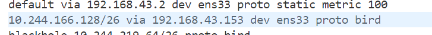

### master 节点部署kubernetes

```bash
hostnamectl set-hostname master

vim /etc/hosts 
192.168.43.152 master
192.168.43.153 node1

swapoff -a
# 关闭并禁用防火墙 
systemctl stop firewalld && systemctl disable firewalld

# 安装docker 
dnf install -y docker 
# 启用docker
systemctl enable docker && systemctl start docker 
# 查看docker版本 
docker --version

sysctl -w net.ipv4.ip_forward=1
echo 1 > /proc/sys/net/bridge/bridge-nf-call-iptables

# 安装kubeadmin、kubelet、kubernetes-master
dnf install -y kubernetes-kubeadm kubernetes-kubelet kubernetes-master
# 安装conntrack组件（k8s依赖组件）
dnf install -y conntrack
# 配置kubelet开机自启
systemctl enable kubelet.service && systemctl start kubelet.service

kubeadm init --apiserver-advertise-address=192.168.43.152 --image-repository registry.aliyuncs.com/google_containers --kubernetes-version v1.20.2 --service-cidr=10.1.0.0/16 --pod-network-cidr=10.244.0.0/16
# 命令选项说明：
# --apiserver-advertise-address：apiserver通告给其他组件的IP地址，一般应该为Master节点的用于集群内部通信的IP地址，0.0.0.0表示节点上所有可用地址
# --image-repository：指定要使用的镜像仓库，指定为aliyun镜像加速下载
# --kubernetes-version：Kubernetes程序组件的版本号
# --pod-network-cidr：Pod网络的地址范围，其值为CIDR格式的网络地址
# --service-cidr：Service的网络地址范围，其值为CIDR格式的网络地址

保存命令
kubeadm join 192.168.43.105:6443 --token "" --discovery-token-ca-cert-hash "" 

# 设置kubectl 访问集群
mkdir -p $HOME/.kube
sudo cp -i /etc/kubernetes/admin.conf $HOME/.kube/config
sudo chown $(id -u):$(id -g) $HOME/.kube/config
```

### 安装calico v3.22

```bash
curl https://projectcalico.docs.tigera.io/archive/v3.22/manifests/calico.yaml -O
kubectl apply -f calico.yaml
```

### node1节点部署kubernetes 软件

```bash
# 安装docker 
dnf install -y docker 
# 启用docker 
systemctl enable docker && systemctl start docker 
# 查看docker版本 
docker --version

sysctl -w net.ipv4.ip_forward=1
echo 1 > /proc/sys/net/bridge/bridge-nf-call-iptables

# 安装kubeadm、kubelet、kubernetes-node
dnf install -y kubernetes-kubeadm kubernetes-kubelet kubernetes-node

# 配置kubelet开机自启
systemctl enable kubelet.service && systemctl start kubelet.service

# 加入集群
kubeadm join 192.168.43.105:6443 --token "" --discovery-token-ca-cert-hash "" 
```

### 测试pod连通性

#### master 节点部署network-tools

```yaml
apiVersion: v1
kind: Pod
metadata:
  name: tool
  namespace: test
spec:
  nodeName: master  # 将 <master-node-name> 替换为 Master 节点的名称
  containers:
    - name: network-multitool
      image: praqma/network-multitool:latest
```

#### 部署 helloworld app

```yaml
apiVersion: apps/v1
kind: Deployment
metadata:
  name: netserver-deployment
  namespace: test
spec:
  selector:
    matchLabels:
      app: netserver
  replicas: 1 # tells deployment to run 2 pods matching the template
  template:
    metadata:
      labels:
        app: netserver
    spec:
      nodeName: node1
      containers:
      - name: netserver
        image: networkstatic/netserver
        command: ["netserver"]
        args: ["-4"]
        ports:
        - containerPort: 12865
---
apiVersion: v1
kind: Service
metadata:
  name: netserver-service
  namespace: test
spec:
  selector:
    app: netserver
  ports:
    - protocol: TCP
      port: 12865
      targetPort: 12865
  type: ClusterIP
```

#### curl 测试

```bash
kubectl exec -it tool -n test -- sh
ping podIP
```

### 问题

一开始master节点的ip route 结果是：
`10.244.166.128/26 via 192.168.43.153 dev tunl0 proto bird `
node1 的ip route结果是 ：
`10.244.219.64/26 via 192.168.43.152 dev ens33 proto bird`
导致无法两个节点的pod无法正常通信
通过 `k edit iPPool default-ipv4-ippool -o yaml`修改  ipipMode: Alaways 为   ipipMode: Never 可正常ping通



以上表示禁用ipip隧道模式
