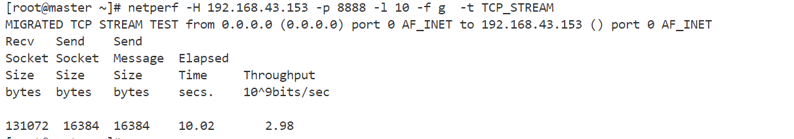
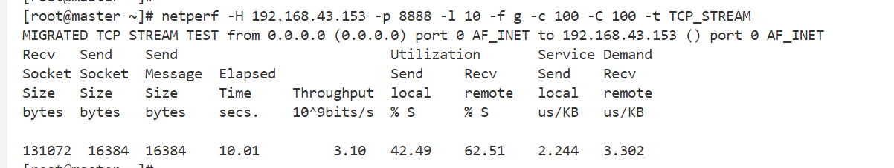
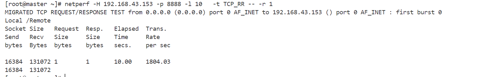
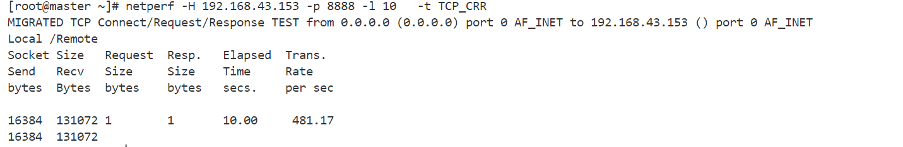
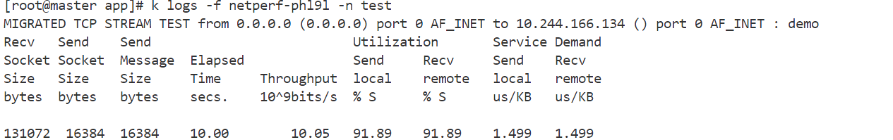
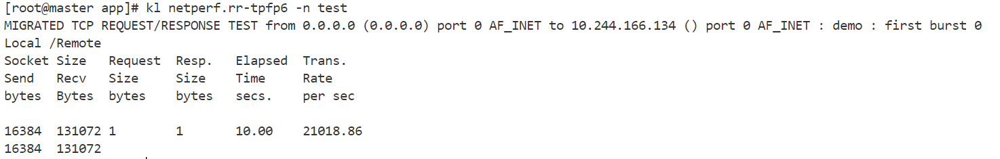
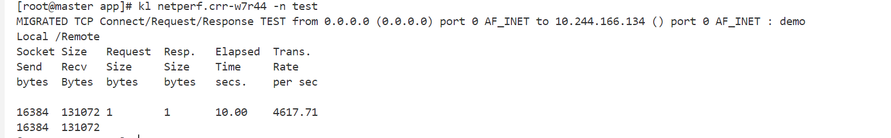
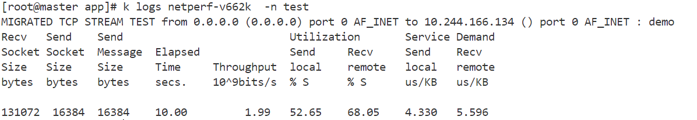
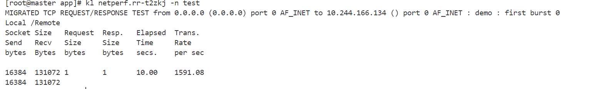
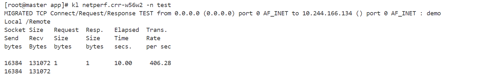

## networking 性能测试

主要使用netperf工具

### 基线 baseline 测试 ： node to node

netperf test case :

1. TCP_STREAM
2. TCP_SENDFILE
3. UDP_STREAM
4. TCP_RR
5. TCP_CRR
6. UDP_RR

##### 服务端启动 ：

```bash
netserver -p 8888 -4
```

##### 每秒的吞吐量 Gbit/s

```bash
netperf -H 192.168.43.153 -p 8888 -l 10 -f g  -t TCP_STREAM
```



##### cpu 使用率

```bash
netperf -H 192.168.43.153 -p 8888 -l 10 -f g -c 100 -C 100 -t TCP_STREAM
```



##### 延迟 ： 每秒多少请求数  request or response/s

```bash
netperf -H 192.168.43.153 -p 8888 -l 10   -t TCP_RR -- -r 1  
# -r 设置每个请求响应的字节数
```



##### 新连接率   new connections/s   TCP_CRR  connect/request/response

```bash
CRR  --> connect/request/response
netperf -H 192.168.43.153 -p 8888 -l 10   -t TCP_CRR
```



##### cpu 火焰图

### 基于calico cni netperf 性能测试

#### 启动服务端

```yaml
apiVersion: apps/v1
kind: Deployment
metadata:
  name: netserver-deployment
  namespace: test
spec:
  selector:
    matchLabels:
      app: netserver
  replicas: 1 # tells deployment to run 2 pods matching the template
  template:
    metadata:
      labels:
        app: netserver
    spec:
      nodeName: node1
      containers:
      - name: netserver
        image: networkstatic/netserver
        command: ["netserver"]
        args: ["-4"]
        ports:
        - containerPort: 12865
---
apiVersion: v1
kind: Service
metadata:
  name: netserver-service
  namespace: test
spec:
  selector:
    app: netserver
  ports:
    - protocol: TCP
      port: 12865
      targetPort: 12865
  type: ClusterIP
```

#### local pod to pod(同节点pod间通信)

##### TCP_STREAM 吞吐量

```yaml
apiVersion: batch/v1
kind: Job
metadata:
  name: netperf
  namespace: test
spec:
  template:
    spec:
      nodeName: node1
      containers:
      - name: netperf
        image: networkstatic/netperf
        command: ["netperf", "-H","10.244.166.134","-l", "10", "-f" ,"g" ,"-c" ,"100" ,"-C" ,"100" ,"-t" ,"TCP_STREAM"]
      restartPolicy: Never
  backoffLimit: 4
```



##### 每秒请求响应数

```yaml
apiVersion: batch/v1
kind: Job
metadata:
  name: netperf.rr
  namespace: test
spec:
  template:
    spec:
      nodeName: node1
      containers:
      - name: netperf
        image: networkstatic/netperf
        command: ["netperf", "-H","10.244.166.134","-l", "10","-t" ,"TCP_RR"]
      restartPolicy: Never
  backoffLimit: 4
```



##### 新连接率   new connections/s    TCP_CRR  connect/request/response

```yaml
apiVersion: batch/v1
kind: Job
metadata:
  name: netperf
  namespace: test
spec:
  template:
    spec:
      nodeName: node1
      containers:
      - name: netperf
        image: networkstatic/netperf
        command: ["netperf", "-H","10.244.166.134","-l", "10","-t" ,"TCP_CRR"]
      restartPolicy: Never
  backoffLimit: 4
```



#### master pod to node1 pod （不同节点间pod通信）

##### TCP_STREAM 吞吐量

```yaml
apiVersion: batch/v1
kind: Job
metadata:
  name: netperf
  namespace: test
spec:
  template:
    spec:
      nodeName: master
      containers:
      - name: netperf
        image: networkstatic/netperf
        command: ["netperf", "-H","10.244.166.134","-l", "10", "-f" ,"g" ,"-c" ,"100" ,"-C" ,"100" ,"-t" ,"TCP_STREAM"]
      restartPolicy: Never
  backoffLimit: 4
```



##### 每秒请求响应数

```yaml
apiVersion: batch/v1
kind: Job
metadata:
  name: netperf
  namespace: test
spec:
  template:
    spec:
      nodeName: master
      containers:
      - name: netperf
        image: networkstatic/netperf
        command: ["netperf", "-H","10.244.166.134","-l", "10","-t" ,"TCP_RR"]
      restartPolicy: Never
  backoffLimit: 4
```



##### 新连接率   new connections/s    TCP_CRR  connect/request/response

```yaml
apiVersion: batch/v1
kind: Job
metadata:
  name: netperf
  namespace: test
spec:
  template:
    spec:
      nodeName: master
      containers:
      - name: netperf
        image: networkstatic/netperf
        command: ["netperf", "-H","10.244.166.134","-l", "10","-t" ,"TCP_CRR"]
      restartPolicy: Never
  backoffLimit: 4
```



### 总结

|                                         | 吞吐量      | 每秒请求响应个数 | 每秒新建连接的个数 |
| --------------------------------------- | ----------- | ---------------- | ------------------ |
| node to node                            | 2.98Gbit/s  | 1804             | 481                |
| local pod to pod                        | 10Gbit/s    | 21018            | 4617               |
| pod to remote pod                       | 1.99Gbit/s  | 1591             | 406.28             |
| local process to process on single node | 24.98Gbit/s | 34905.01         | 5419.44            |
